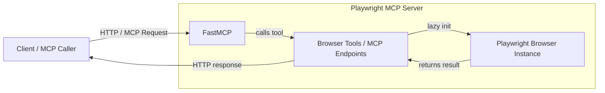

# Playwright MCP Server With FastMCP and Test on Postman 

> A production-ready [Model Context Protocol (MCP)](https://modelcontextprotocol.io/) server that exposes full browser automation over HTTP — built with [FastMCP](https://github.com/pydantic/fastmcp) and [Playwright](https://playwright.dev/python/), deployable to Azure App Service.


Control a real Chromium browser through simple HTTP calls. No Selenium, no WebDriver setup, no manual MCP protocol boilerplate. Define browser actions as Python functions — FastMCP handles the routing, async execution, and HTTP transport automatically.

## When to Use This

| Use Case | Example |
|----------|---------|
| **AI agent browser control** | Let an LLM agent navigate, click, and scrape web pages via MCP tool calls |
| **End-to-end test automation** | Drive a real Chromium browser over HTTP from any language or test runner |
| **Web scraping pipelines** | Extract DOM snapshots, evaluate JS, and capture screenshots programmatically |
| **RPA (Robotic Process Automation)** | Automate repetitive web workflows — form filling, file uploads, multi-tab flows |
| **Automated screenshots / visual monitoring** | Capture full-page screenshots of any URL on demand |
| **Remote browser execution** | Run browser automation on a server or in Azure without a local display |

### When NOT to Use This

- You only need static HTML parsing — use `requests` + `BeautifulSoup` instead
- You need parallel browsers at scale — consider Playwright's own grid or Playwright Test
- You need a full GUI test framework with assertions and reports — use Playwright Test or Pytest-Playwright directly

## Architecture

### Project Files

| File | Purpose |
|------|---------|
| `server.py` | Main MCP server — registers all browser tools and starts FastMCP |
| `validate_server.py` | Pre-flight checker — verifies all imports and runtime dependencies |
| `requirements.txt` | Python dependency list |

### How It Works

- `server.py` creates a `FastMCP` server using `stateless_http=True` and `transport="streamable-http"`
- Browser automation tools are plain Python async functions decorated with `@mcp.tool()`
- Playwright is **lazily initialized** — the Chromium browser only starts on the first tool call
- A single browser instance (`playwright`, `browser`, `context`, `page`) is reused across all requests
- A `health_check` tool acts as a lightweight Azure App Service health probe — it responds instantly without starting the browser
- The server binds to `0.0.0.0` and reads the `PORT` environment variable (default `8000`)

## Architecture Diagram



> **Step-by-step:**
> 1. Client sends an HTTP POST to `http://localhost:8000/mcp`
> 2. `FastMCP` receives and dispatches the request to the matching browser tool
> 3. The tool lazily starts Playwright + Chromium if not already running
> 4. Playwright executes the browser action (navigate, click, screenshot, etc.)
> 5. The result is returned as JSON over HTTP

## Features

| | |
|---|---|
| **Lazy-loaded browser** | Chromium starts on first tool call — zero startup overhead |
| **Full browser automation** | Navigate, click, type, screenshot, evaluate JS, DOM snapshot, and more |
| **Azure App Service ready** | Built-in `health_check` tool satisfies Azure health probes instantly |
| **Async / await** | Every tool is a native Python async function — no blocking calls |
| **Streamable HTTP transport** | FastMCP uses streamable-http for real-time MCP communication |
| **Postman testable** | Any HTTP client can call the `/mcp` endpoint directly |

## Tools Available

| Tool | Description | Input |
|------|-------------|-------|
| `health_check()` | Returns server health status | None |
| `browser_navigate()` | Navigate to a URL | `url: str` |
| `browser_navigate_back()` | Go back in browser history | None |
| `browser_click()` | Click an element | `ref: str` (CSS selector) |
| `browser_drag()` | Drag and drop between elements | `startRef`, `endRef` |
| `browser_hover()` | Hover over an element | `ref: str` |
| `browser_type()` | Type text into an element | `ref: str`, `text: str` |
| `browser_fill_form()` | Fill multiple form fields | `fields: list` |
| `browser_file_upload()` | Upload files to a file input | `files: list` |
| `browser_press_key()` | Press a keyboard key | `key: str` |
| `browser_resize()` | Resize the browser window | `width: int`, `height: int` |
| `browser_console_messages()` | Retrieve page console messages | `level: str` |
| `browser_handle_dialog()` | Handle alerts/prompts/confirmations | `accept: bool` |
| `browser_evaluate()` | Execute JavaScript in page context | `function: str` |
| `browser_snapshot()` | Capture page DOM/accessibility snapshot | `url: str` (optional) |
| `browser_network_requests()` | Get network requests made by the page | `static: bool`, `requestBody: bool`, `requestHeaders: bool` |
| `browser_run_code()` | Execute custom Playwright code | `code: str`, `filename: str` |
| `browser_select_option()` | Select option(s) from a dropdown | `ref: str`, `values: list` |
| `browser_tabs()` | Manage browser tabs | `action: str` |
| `browser_wait_for()` | Wait for text, element, or timeout | Depends on parameters |
| `browser_take_screenshot()` | Take a screenshot | `filename: str`, `fullPage: bool` |
| `browser_close()` | Close the browser | None |

## Prerequisites

- Python 3.8+
- pip or conda

## Installation

1. **Clone or download this project**

2. **Create a virtual environment**
   ```bash
   python -m venv .venv
   ```

3. **Activate the virtual environment**
   - **Windows:**
     ```bash
     .venv\Scripts\activate
     ```
   - **Linux/macOS:**
     ```bash
     source .venv/bin/activate
     ```

4. **Install dependencies**
   ```bash
   pip install -r requirements.txt
   ```

## Running Locally

```bash
python server.py
```

The server will start on `http://0.0.0.0:8000` by default.

### Custom Port

Set the `PORT` environment variable to use a different port:

```bash
# Windows
set PORT=3000
python server.py

# Linux/macOS
export PORT=3000
python server.py
```

## Quick Usage Example

With the server running, call any tool via the `/mcp` endpoint:

```bash
curl -X POST http://localhost:8000/mcp \
  -H "Content-Type: application/json" \
  -d '{
    "method": "tools/call",
    "params": {
      "name": "browser_navigate",
      "arguments": { "url": "https://example.com" }
    }
  }'
```

Expected response:
```json
{ "status": "navigated", "url": "https://example.com" }
```

## Test With Postman

You can also test MCP functionality using Postman and the running `http://localhost:8000/mcp` endpoint.

1. Open Postman.
2. Create a new MCP request or a new HTTP POST request if your version does not expose MCP request types.
3. Set the request URL to:

   ```text
   http://localhost:8000/mcp
   ```

4. Set the request body to raw JSON and use the following payload for a navigation test:

   ```json
   {
     "method": "tools/call",
     "params": {
       "name": "browser_navigate",
       "arguments": {
         "url": "https://example.com"
       }
     }
   }
   ```

5. Click **Send** or **Run**.
6. Review the response panel to confirm the tool execution and any returned status.


## Deployment to Azure

### Prerequisites
- Azure CLI installed
- An Azure subscription
- Docker (optional, for containerization)

> **Recommended: Use Docker deployment below.** Plain App Service Python runtime does not include Chromium system dependencies and will fail to launch the browser.

### Using Azure App Service (Docker-based)

1. **Create an App Service with a custom container**
   ```bash
   az appservice plan create --name <plan-name> --resource-group <rg-name> --sku B2 --is-linux
   az webapp create --resource-group <rg-name> --plan <plan-name> --name <app-name> --deployment-container-image-name <your-acr>.azurecr.io/playwright-mcp-server:latest
   ```

2. **Configure environment**
   ```bash
   az webapp config appsettings set --resource-group <rg-name> --name <app-name> \
     --settings PORT=8000 HEADLESS=true
   ```

3. **Configure the health probe** (Azure Portal → App Service → Health Check)
   - Set path to `/mcp`

### Docker Deployment (Recommended)

Create a `Dockerfile`:
```dockerfile
FROM python:3.11-slim

WORKDIR /app

COPY requirements.txt .

# Install Python dependencies and Playwright with all Chromium system dependencies
RUN pip install --no-cache-dir -r requirements.txt \
    && playwright install --with-deps chromium

COPY . .

EXPOSE 8000

ENV HEADLESS=true

CMD ["python", "server.py"]
```

Build and run:
```bash
docker build -t playwright-mcp-server .
docker run -p 8000:8000 playwright-mcp-server
```

## Environment Variables

| Variable | Default | Description |
|----------|---------|-------------|
| `PORT` | `8000` | Port the server listens on |
| `HEADLESS` | `true` | Set to `false` to show the browser window (local dev only) |

## Testing

### Validate Dependencies

```bash
python validate_server.py
```

### Run the Test Suite

```bash
python test_fastmcp_simple.py
```

### Test with MCP Inspector (Recommended)

[MCP Inspector](https://github.com/modelcontextprotocol/inspector) is the official interactive tool for exploring and testing MCP servers. It gives you a visual UI to browse all registered tools, call them with custom inputs, and inspect responses — no Postman or curl needed.

**Prerequisites:** Node.js installed

1. Start the server:
   ```bash
   python server.py
   ```

2. In a new terminal, launch MCP Inspector:
   ```bash
   npx @modelcontextprotocol/inspector
   ```

3. Open the Inspector UI (it will print a local URL, typically `http://localhost:5173`)

4. Connect to your running server:
   - Transport: **SSE** or **Streamable HTTP**
   - URL: `http://localhost:8000/mcp`

5. You will see all registered tools (`browser_navigate`, `browser_click`, `browser_take_screenshot`, etc.) listed in the left panel. Click any tool, fill in the inputs, and hit **Run Tool** to test it live.

> MCP Inspector is the fastest way to verify your server is working correctly before deploying to Azure.

## Project Structure

```
.
├── server.py              # Main MCP server application
├── requirements.txt       # Python dependencies
├── test_fastmcp_simple.py # Test suite
├── validate_server.py     # Dependency validation
├── README.md              # This file
└── .venv/                 # Virtual environment (auto-generated)
```

## Troubleshooting

**Browser won't initialize:**
- Ensure Playwright chromium is installed: `playwright install chromium`
- Check system dependencies are installed (Linux/macOS)

**Port already in use:**
- Change the PORT environment variable to an available port

**Timeout errors:**
- Increase browser timeout or check network connectivity to target URLs

**Screenshots not saving:**
- Ensure the path specified in `filename` is writable by the server process
- Defaults to the current working directory

**JavaScript evaluation fails:**
- The function must be a valid JS expression returning a serializable value
- Example: `"() => document.title"` not `"document.title"`

## References

- [Playwright Python Docs](https://playwright.dev/python/)
- [FastMCP GitHub](https://github.com/pydantic/fastmcp)
- [MCP Protocol Spec](https://modelcontextprotocol.io/)
- [Azure App Service Deployment](https://learn.microsoft.com/en-us/azure/app-service/)

